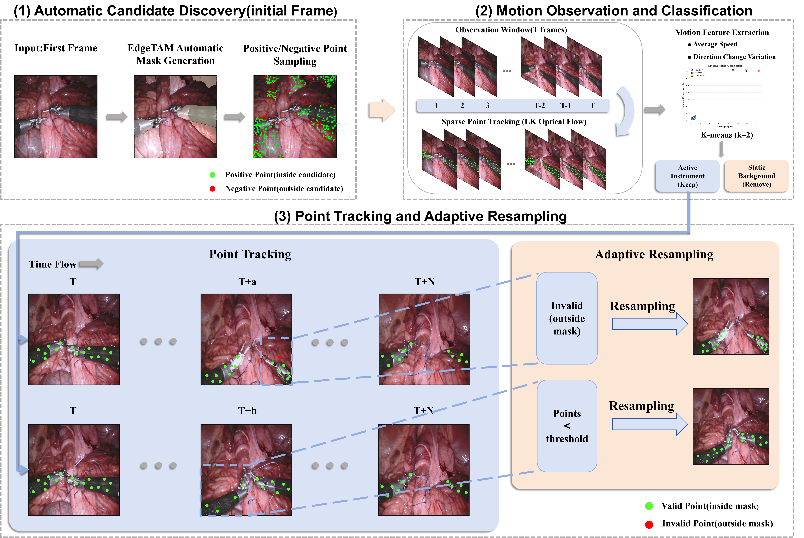

# stTAM

**Training-Free Surgical Instrument Tracking Based on TAM and Motion-Trajectory Classification**

Gang He, Ning Dai, Xingyu Yang, Hui Chen, Tengfei Chen, Yongbing Chen

Gang He and Ning Dai contributed equally.



stTAM combines automatic candidate discovery, motion-based candidate filtering,
and mask-guided sparse-point tracking using a frozen EdgeTAM backbone.
Motion classification distinguishes active instrument candidates from background;
it does not predict semantic instrument categories.

This repository provides the inference code and a short video demonstration.
The two inference presets consolidate the existing EndoVis2017 and CholecTrack20
scripts. Benchmark annotations, detector weights, evaluation and ablation suites
are not included, and this release does not reproduce every table in the paper.
The demo uses standard EdgeTAM, without the local experimental CAM/ORM extensions.

## Files

```text
stTAM_GitHub/
├── README.md
├── LICENSE
├── framework.png
├── sttam.py
├── configs/
│   ├── endovis2017.yaml
│   └── cholectrack20_shared.yaml
└── tests/
    ├── test_tracking.py
    └── cholectrack20_demo.mp4
```

`sttam.py` contains the stTAM inference logic, frame streaming adapter,
motion classification, anchor maintenance, visualization and shared-box association.
EdgeTAM is installed as an external dependency; its network and pretrained weights
are not copied into this repository.

## Installation

Use Python 3.10 or later. Install a compatible PyTorch/torchvision pair from
[PyTorch](https://pytorch.org/get-started/locally/), with CUDA support for GPU use.
Then install [EdgeTAM](https://github.com/facebookresearch/EdgeTAM) and the demo dependencies:

```bash
python -m pip install "git+https://github.com/facebookresearch/EdgeTAM.git"
python -m pip install opencv-python numpy scipy scikit-learn scikit-image PyYAML timm
```

Download `edgetam.pt` using the instructions in the official EdgeTAM repository.
Supply its actual path with `--checkpoint`. EdgeTAM's upstream timm backbone may
also download ImageNet initialization weights on its first construction; allow
network access or prepare that cache in advance. The supplied full EdgeTAM
checkpoint then loads the tracking network weights.
Do not substitute the original SAM 2 package for EdgeTAM: both use the `sam2` import name.

## Video demo

From the repository root:

```bash
python tests/test_tracking.py --checkpoint /path/to/edgetam.pt
```

The default demo processes 150 frames of the supplied VID39 clip in **mask-only**
mode. It uses the CholecTrack20 preset and explicitly overrides its box source,
so no detector cache is needed for this command. The first 51 frames are used for
the observation/classification stage. Output files are created under `outputs/demo/`:

- `tracking.mp4`: candidate/instrument masks, boxes and identities.
- `tracks.txt`: tracking boxes after classification, in MOT-style rows
  `frame,id,x,y,width,height,score,-1,-1,-1`; frame numbers are local and one-based.

Add `--show` for a display window, `--device cpu` to select CPU, or
`--max-frames 0` to process the entire clip. CPU inference is substantially slower.
No FPS or benchmark accuracy is inferred from this demonstration.

## Configurations

**EndoVis2017:** automatic first-frame masks, positive/negative point prompts,
trajectory slope variance and mean speed, K-means filtering, mask-gated LK anchors
and adaptive resampling. Input may be a video or a directory of naturally sorted
JPG, PNG or BMP frames (5 FPS is used when writing a frame-directory video).

```bash
python sttam.py --config configs/endovis2017.yaml --input /path/to/frames --checkpoint /path/to/edgetam.pt --output outputs/endovis
```

**CholecTrack20 shared boxes:** the preset contains the existing VID39 demo settings,
including camera-compensated motion scoring and mask-to-box postprocessing. It is
specific to this clip, not a universal setting for all CholecTrack20 sequences.
The shared mode reads externally supplied YOLO11n detection boxes and transfers
stTAM identities by one-to-one IoU association. Unmatched tracks retain their mask
boxes, matching the source script. Detections do not replace automatic mask discovery.
The task-trained detector is separate from the frozen stTAM model.

```bash
python tests/test_tracking.py --checkpoint /path/to/edgetam.pt --shared-detections /path/to/yolo11_detections.json
```

The JSON cache must contain one list per **local input frame**, beginning at frame
zero, with each detection represented as `[x1, y1, x2, y2, confidence, class]`:

```json
{"detections": [[[100, 80, 200, 220, 0.95, 0]], []]}
```

The example illustrates two frames only. A real cache must cover the requested run
and align with the exact clip and its original resolution. The paper's shared
detector setting uses YOLO11n, confidence 0.1 and input size 512. This script
consumes a prepared cache; it does not run or train YOLO.

Both presets discover candidates only on the first frame and do not discover new
instruments entering later. Strong camera motion, stationary instruments and
occlusion can affect candidate selection and tracking.

## Data and license

`tests/cholectrack20_demo.mp4` is a copy of the existing, unannotated
`VID39/vid39_sttam_main_v2_cut.mp4` clip from CholecTrack20: 854 × 480, 25 FPS,
1,451 frames (approximately 58 seconds). It is supplied here for local review.
Dataset rights remain with the CholecTrack20 authors; the code license does not
relicense the video. Confirm the dataset's redistribution terms before publishing
this video in a public repository.

The source code is licensed under Apache-2.0 (see `LICENSE`). The streaming adapter
derives from EdgeTAM/SAM 2 code, copyright Meta Platforms, Inc. and affiliates,
also under Apache-2.0. EdgeTAM weights and external detection data retain their own
terms. The framework image belongs to the stTAM authors.

## Acknowledgements

This work was supported by the National Natural Science Foundation of China
(Grant Nos. 12572364 and 12272033) and the Construction Project of the Fujiang
Laboratory Nuclear Medicine Artificial Intelligence Research Center
(No. 2023ZYDF074).

We thank the authors of EdgeTAM, SAM 2, EndoVis2017 and CholecTrack20.
